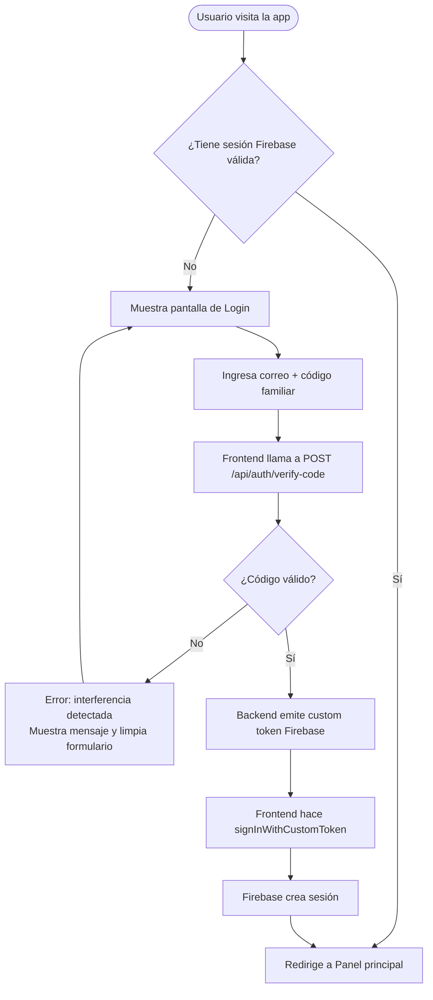
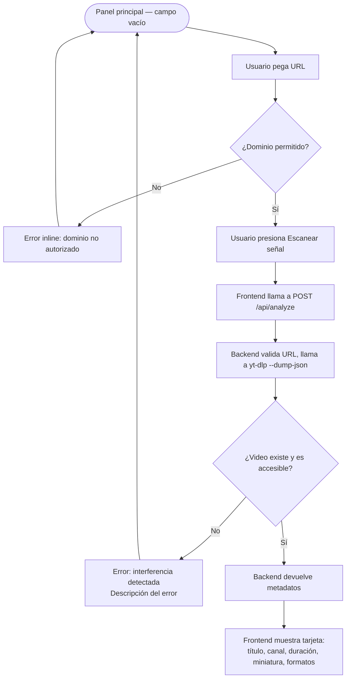
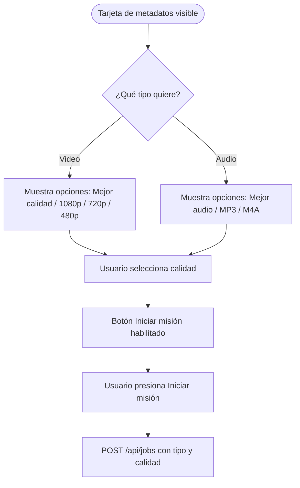
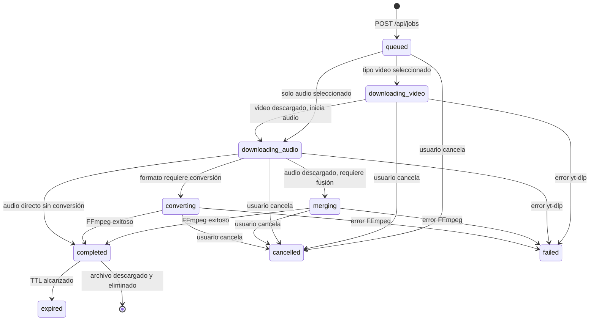

# USER_FLOW.md — Pixel Drop

## Navegación general

La aplicación tiene tres zonas principales:

| Zona | Ruta | Acceso |
|---|---|---|
| Login | `/login` | Pública (redirige a `/` si ya hay sesión) |
| Panel principal | `/` | Requiere autenticación |
| Descarga activa | `/` (modal o sección inline) | Requiere autenticación + trabajo activo |

No hay navegación lateral ni menú complejo. El flujo es lineal: login → análisis → descarga → archivo.

---

## 1. Flujo de acceso

### 1.1 Primera visita



### 1.2 Sesión persistente

- Firebase mantiene la sesión en `localStorage` / IndexedDB del navegador.
- En cada carga, el frontend verifica el token. Si expiró, redirige a `/login`.
- El backend verifica el ID token de Firebase en cada llamada API. Si es inválido, responde `401`.

### 1.3 Cierre de sesión

El usuario puede cerrar sesión desde el panel. Llama a `signOut()` de Firebase y redirige a `/login`.

---

## 2. Flujo principal: análisis de URL

El análisis (`POST /api/analyze`) es una operación previa e independiente a la creación de un trabajo. No crea ningún `Job` ni utiliza `JobState`. El estado "escaneando señal" es exclusivamente un estado de la interfaz.



**La validación de dominio se realiza en el frontend antes de enviar al backend**, y también en el backend antes de llamar a yt-dlp.

---

## 3. Flujo de selección de formato



Solo se muestran las calidades que el análisis previo confirmó disponibles.

---

## 4. Flujo de progreso y descarga

`POST /api/jobs` devuelve `{ "jobId": "uuid-v4" }`. El frontend abre inmediatamente la conexión SSE usando `@microsoft/fetch-event-source` con el token Firebase en la cabecera `Authorization`.

```mermaid
flowchart TD
    A([POST /api/jobs devuelve jobId]) --> B[Frontend abre SSE:\nGET /api/jobs/{job_id}/events\nAuthorization: Bearer token]
    B --> C{Estado del trabajo}
    C -- queued --> D[Muestra: En cola de misiones]
    C -- downloading_video --> F[Muestra barra de progreso de video]
    C -- downloading_audio --> G[Muestra barra de progreso de audio]
    C -- merging --> H[Muestra: Procesando transmisión]
    C -- converting --> I[Muestra: Procesando transmisión]
    C -- completed --> J[Muestra: Misión completada\nBotón de descarga habilitado]
    C -- failed --> K[Muestra: Interferencia detectada\nDescripción técnica del error]
    C -- cancelled --> L[Muestra: Misión abortada]
    C -- expired --> M[Muestra: Señal expirada\nPuede iniciar nueva misión]
```

La barra de progreso muestra porcentaje numérico junto al gráfico segmentado para accesibilidad.

**Nota:** El estado `queued` normalmente dura muy poco y puede no ser visible al usuario antes de transicionar a `downloading_*`.

**Nota:** Los estados `merging` y `converting` son distintos internamente en el backend. Ambos se muestran al usuario con el texto `PROCESANDO TRANSMISIÓN`.

---

## 5. Flujo de cancelación

```mermaid
flowchart TD
    A([Descarga en curso]) --> B[Usuario presiona Abortar misión]
    B --> C[Frontend solicita confirmación: modal ligero]
    C -- No cancelar --> A
    C -- Confirmar --> D[POST /api/jobs/{job_id}/cancel]
    D --> E[Backend detiene proceso yt-dlp]
    E --> F[Backend elimina archivos temporales del trabajo]
    F --> G[SSE emite estado: cancelled]
    G --> H[Frontend muestra: Misión abortada\nBotón para nueva misión]
```

---

## 6. Flujo de entrega del archivo

```mermaid
flowchart TD
    A([Estado: completed]) --> B[Frontend muestra botón Descargar archivo]
    B --> C[Usuario presiona el botón]
    C --> D[GET /api/jobs/{job_id}/download\nAuthorization: Bearer token]
    D --> E{¿Archivo existe y token válido?}
    E -- No --> F[Error: señal expirada]
    E -- Sí --> G[Backend sirve el archivo con Content-Disposition: attachment]
    G --> H[Navegador descarga el archivo]
    H --> I[Backend elimina el archivo tras servicio exitoso]
```

El archivo también se elimina si transcurre el TTL (por defecto 15 minutos) sin que el usuario lo descargue.

---

## 7. Manejo de errores

| Causa | Mensaje temático | Descripción técnica mostrada |
|---|---|---|
| URL de dominio no permitido | Señal no autorizada | Solo se aceptan URLs de YouTube |
| 401 — Token inválido o expirado | Acceso denegado | Tu sesión ha expirado. Inicia sesión nuevamente |
| 403 — Usuario inactivo | Acceso restringido | Tu cuenta no tiene acceso activo |
| 404 análisis — Video no encontrado | Señal perdida | El video no existe o fue eliminado |
| 410 download — Archivo expirado | Señal expirada | El archivo ya no está disponible. Puedes reiniciar la misión |
| 429 — Rate limit | Sobrecarga de frecuencia | Espera unos segundos antes de intentarlo de nuevo |
| 500 — Error del servidor | Interferencia detectada | Error interno. Intenta de nuevo en unos momentos |
| yt-dlp — Video privado / geobloqueado | Señal bloqueada | El video no es accesible desde este servidor |
| SSE — Conexión perdida | Conexión perdida | La misión fue interrumpida porque el motor de descarga se reinició. Inicia nuevamente la descarga. |

Todos los errores muestran:
1. Ícono temático.
2. Título en lenguaje arcade.
3. Descripción técnica legible.
4. Acción disponible (reintentar / nueva misión / cerrar).

---

## 8. Caducidad de archivo

- TTL por defecto: **15 minutos** desde que el trabajo alcanza `completed`.
- La tarjeta de resultado muestra un contador de cuenta regresiva visible.
- A los 2 minutos restantes, el contador parpadea (respeta `prefers-reduced-motion`).
- Al expirar, el estado cambia a `expired` y el botón de descarga se deshabilita.
- El usuario puede iniciar una nueva misión con la misma URL.

---

## 9. Restricciones de flujo

| Restricción | Valor por defecto | Variable de entorno |
|---|---|---|
| Trabajos simultáneos por usuario | 1 | `MAX_CONCURRENT_JOBS_PER_USER` |
| TTL del archivo completado | 15 min | `FILE_TTL_MINUTES` |
| Duración máxima del video | 7200 s (2 horas) | `MAX_VIDEO_DURATION_SECONDS` |
| Tamaño máximo estimado del archivo | 2 GB | `MAX_FILE_SIZE_BYTES` |
| Timeout máximo del proceso yt-dlp | 3600 s (1 hora) | `YTDLP_TIMEOUT_SECONDS` |
| Intentos de login fallidos | 5 (luego bloqueo temporal) | Configurable |

---

## 10. Diagrama de estados de un trabajo



---

## 11. Resiliencia de la conexión SSE

La conexión SSE se gestiona con `@microsoft/fetch-event-source`, que permite enviar cabeceras personalizadas (`Authorization`). El token Firebase nunca se pasa como query parameter, en rutas ni en mensajes SSE.

### Heartbeat del servidor

El backend emite un comentario SSE de heartbeat cada 15 segundos mientras el trabajo está activo. Esto mantiene la conexión viva y permite al frontend detectar interrupciones.

```
: heartbeat
```

El heartbeat no modifica el estado del trabajo.

### Detección de interrupción en el frontend

| Condición | Acción del frontend |
|---|---|
| Sin eventos durante 30–45 s | Considera la conexión interrumpida |
| Primer intento de reconexión | Reintenta automáticamente (con back-off exponencial, máx. 3 intentos) |
| Antes de declarar el trabajo perdido | Consulta `GET /api/jobs/{job_id}` con el token actual |
| El trabajo existe y tiene estado final | Muestra el estado correspondiente |
| El trabajo no existe (backend reiniciado) | Muestra error `CONEXIÓN PERDIDA` |

### Mensaje de conexión perdida

```
CONEXIÓN PERDIDA
La misión fue interrumpida porque el motor de descarga se reinició.
Inicia nuevamente la descarga.
```

Acción disponible: botón `[ NUEVA MISIÓN ]`.

### Limpieza en el arranque del backend

Al iniciar, el backend limpia el directorio `tmp/` completo para eliminar archivos huérfanos de sesiones anteriores. Los trabajos en memoria no se persisten entre reinicios del servidor.
